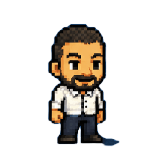

  

  

<h3 align="center">🚀 AI & Big Data Engineer in training | LLMs • RAG • Full-Stack Development</h3>

  
  
  

---

### 🧑‍💻 About Me

Computer Science graduate specializing in Big Data & Data Analysis, and currently an Engineering Student in Computer Science. Passionate about AI, LLMs, and building web and mobile applications.
- 🌐 Languages: Arabic (native), English (fluent), French (intermediate), Turkish (intermediate)

---

### 🛠️ Tech Stack

**Languages**

  
  
  
  
  
  
  

**Frameworks & Libraries**

  
  
  
  
  
  

**Databases**

  
  
  

**AI / LLM Tooling**

  
  
  
  
  

**Tools**

  
  
  
  
  

---

### 📜 Certifications

| Provider | Certification | Year |
|---|---|---|
|   | Generative AI with Large Language Models | 2025 |
|  | Getting Started with Deep Learning | 2024 |
|  | Introduction to Transformer-Based Natural Language Processing | 2024 |
|  | Generative AI With Diffusion Models | 2025 |

---

### 📊 GitHub Stats

  

  

---

### 📫 Let's Connect

  📍 Sfax, Tunisia &nbsp;•&nbsp; 📞 +216 99 003 704 &nbsp;•&nbsp; ✉️ abdulwahebbenhaj@gmail.com

